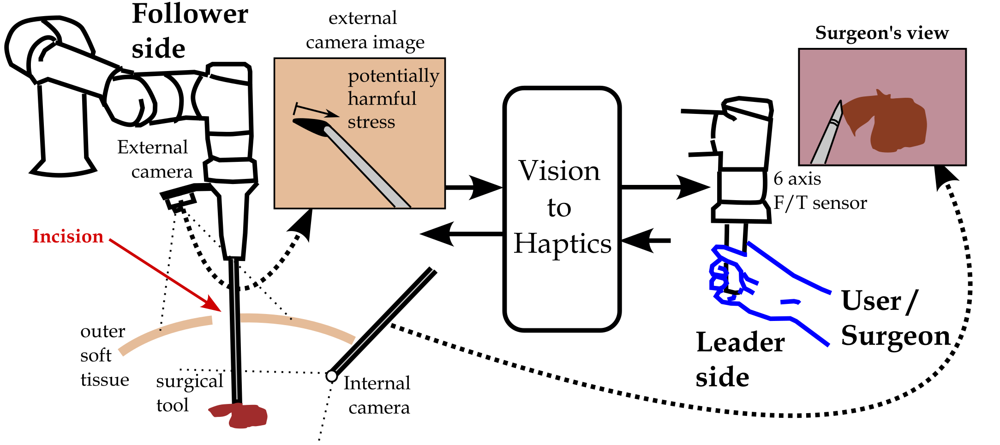

# vis2haptics

This code implements the Vision-to-haptics control scheme for DCNN-based guidance during leader-follower surgery.

The DCNN was developed utilizing the Pytorch library. The implementation of the network is based on the template provided by the following GitHub repository: [pytorch_image_regession](https://github.com/hugohadfield/pytorch_image_regession).

  

Robotic-Assisted Minimally Invasive Surgery (RAMIS) has gained the attention of researchers worldwide, as it  minimizes the infection risk and iatrogenic harm done to the patient, due to the fact that the surgical tool enters the human body through a tiny incision. A critical issue in RAMIS is to ensure that the incision (tool entrance) is not further damaged due to excessive stress applied by the surgical tool. In this work, a vision-to-haptics control scheme for a leader-follower robotic setup is proposed, that provides the surgeon with the appropriate force/torque feedback for avoiding further stress applied to the incision, in real-time. In the core of the method, a Deep Convolutional Neural Network (DCNN) is employed that is able to identify and quantify potentially harmful situations. The proposed method is proven to be passive and it is experimentally evaluated using a leader-follower setup. The results show the reduction of the deformation of the incision hole by the tool shaft, as compared to the case in which no force-feedback was provided to the human-user.  
